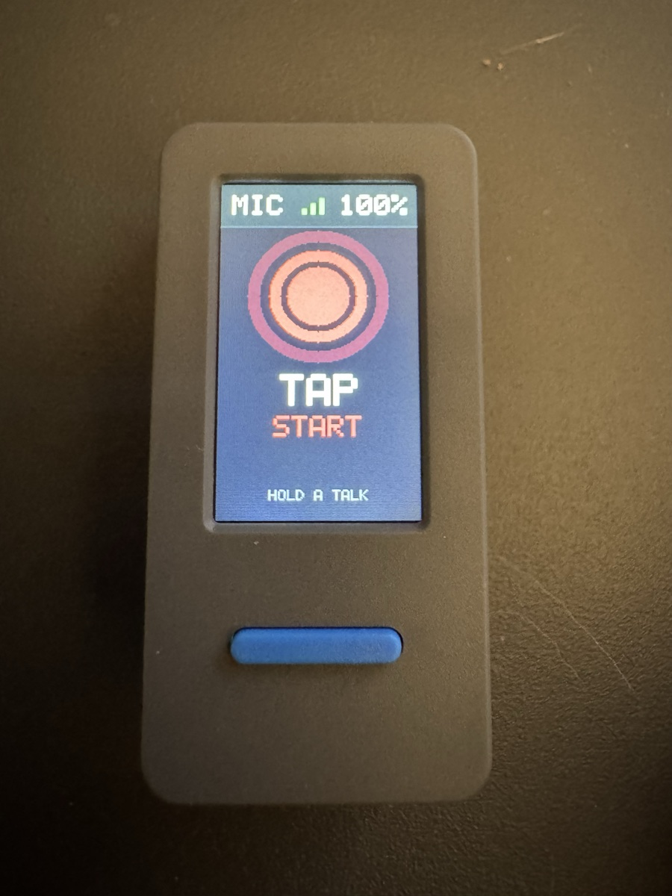
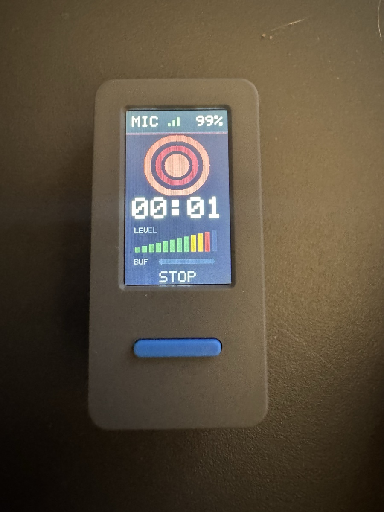

# m5mic

Rust firmware and a Rust desktop receiver for using an M5StickS3 as a live microphone.

The firmware has two transports:

1. USB Audio Class microphone. On macOS, it lists as `m5mic` from manufacturer `M5Stack`, 1 channel at 16 kHz.
2. Raw `pcm_s16le` over WebSocket to the Rust receiver.

Wireless discovery is handled two ways:

1. The receiver advertises `_m5mic._tcp.local` via mDNS.
2. The firmware falls back to UDP broadcast on port `47777`.

## Photos

<p>
  
  
</p>

## Receiver

Foreground development:

```sh
mkdir -p captures
cargo run -p m5mic-receiver -- --output-dir captures
```

It listens on `0.0.0.0:47776`, accepts WebSocket connections at `/audio`, and writes each stream to a WAV file.

Detached tmux session:

```sh
tmux new-session -d -s m5mic-receiver -c "$PWD" 'mkdir -p captures && cargo run -p m5mic-receiver -- --output-dir captures'
```

Useful commands:

```sh
tmux attach -t m5mic-receiver
tmux kill-session -t m5mic-receiver
lsof -nP -iTCP:47776
```

In wireless mode, tap BtnA once to start a locked recording and tap BtnA again to stop. Hold BtnA for push-to-talk; release it to stop. Each start/stop cycle creates a separate WAV file on the receiver.

Short-tap BtnB to toggle between wireless mode and USB mic mode. Hold BtnB during boot, or hold BtnB for about two seconds while idle, to start the captive setup portal.

Wi-Fi setup is optional. Join the `M5Mic-XXXX` access point and open `http://192.168.71.1` if the captive page does not appear automatically. Saved Wi-Fi credentials are stored in NVS and take priority over the build-time `WIFI_SSID` / `WIFI_PASS` fallback.

## UI Preview

```sh
tmux new-session -d -s m5mic-preview -c "$PWD" 'uv run python -m http.server 4177 --bind 127.0.0.1 --directory preview'
```

Open `http://127.0.0.1:4177/`.

## Firmware

Install the ESP Rust toolchain if needed:

```sh
espup install
. ~/export-esp.sh
```

Put build-time fallback Wi-Fi credentials in `.env.local` at the repo root; that file is ignored by git:

```sh
WIFI_SSID='your ssid'
WIFI_PASS='your pass'
```

Build for StickS3:

```sh
cd firmware
. ~/export-esp.sh
set -a
. ../.env.local
set +a
cargo +esp build --release
```

Flash the StickS3:

```sh
cd firmware
espflash flash --port <serial-port> target/xtensa-esp32s3-espidf/release/m5mic-firmware
```

After flashing USB Audio firmware, the app owns the native USB device stack while running. If serial monitoring over the same USB cable is unavailable, flash without `--monitor` and use the screen state for basic feedback.

Optional direct receiver override:

```sh
cd firmware
set -a
. ../.env.local
set +a
M5MIC_SERVER_URL='ws://192.168.1.10:47776/audio' cargo +esp build --release
espflash flash --port <serial-port> target/xtensa-esp32s3-espidf/release/m5mic-firmware
```

## Hardware Notes

The StickS3 audio path uses an ES8311 codec at I2C `0x18`, not a direct PDM mic.

Relevant pins from the M5Stack StickS3 docs and M5Unified:

| Signal | GPIO |
|---|---:|
| ES8311 MCLK | 18 |
| ES8311 DOUT to ESP32-S3 DIN | 16 |
| ES8311 BCLK | 17 |
| ES8311 LRCK | 15 |
| ES8311 I2C SCL | 48 |
| ES8311 I2C SDA | 47 |
| BtnA / KEY1 | 11 |
| BtnB / KEY2 | 12 |
