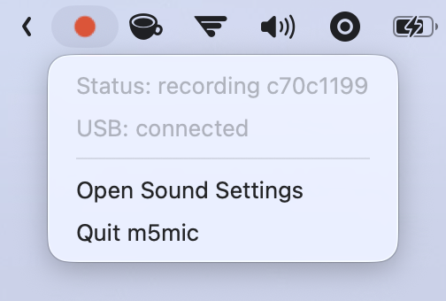

# m5mic

Rust firmware and a macOS menu-bar app for using an M5StickS3 as either a standalone USB microphone or a wireless microphone.

The firmware supports two microphone paths:

1. USB Audio Class microphone. Plug it in and select `m5mic` in your OS or app. No Wi-Fi, receiver, menu-bar app, or driver install is required.
2. Wireless `pcm_s16le` over WebSocket. On macOS, the m5mic menu-bar app exposes this live stream as a system input device through a Rust CoreAudio driver named `m5mic`. The standalone receiver CLI can optionally save raw WAV captures for debugging.

Wireless discovery is handled two ways:

1. The receiver advertises `_m5mic._tcp.local` via mDNS.
2. The firmware falls back to UDP broadcast on port `47777`.

The macOS menu-bar app is only required for wireless virtual microphone mode. It can also switch between wireless and USB mode, set the macOS default input, and send a UDP mode command to the StickS3 on port `47779`; the USB menu item only appears while macOS sees the USB `m5mic` input.

## Photos

<p>
  
  
</p>

## macOS Menu Bar App

USB mic mode does not require the Mac app: plug in the StickS3 and select `m5mic` as the input. The menu-bar app is for wireless virtual mic mode on macOS, plus optional status and mode switching. It shows a red outline dot while idle, a filled red dot while the StickS3 is streaming audio, receiver status, driver status, USB connection status, and mode-switch actions.

The menu-bar app does not save recordings by default. It receives live audio and feeds the virtual microphone only.

<p>
  
</p>

Download the latest notarized macOS release from [GitHub Releases](https://github.com/nicosuave/m5mic/releases/latest). Unzip it, drag `m5mic.app` to `/Applications`, then open it. If the CoreAudio virtual microphone driver is not installed yet, the app prompts to install it with the standard macOS administrator dialog.

The release also includes `install-driver.sh` for manual repair if the in-app install is skipped or interrupted.

To build from source instead:

```sh
scripts/build-statusbar-app.sh
open target/m5mic.app
```

For source builds, the app bundles `target/m5mic.driver` and uses the same in-app installer. You can still install or repair the driver manually:

```sh
scripts/install-coreaudio-driver.sh
```

After install, macOS apps can select wireless `m5mic` as an input device. Use the menu to:

- switch to wireless mode and select the virtual `m5mic` input
- switch to USB mode and select the USB `m5mic` input, when plugged in
- open Sound Settings
- quit the receiver

Uninstall the driver:

```sh
scripts/uninstall-coreaudio-driver.sh
```

## Maintainer Release

`scripts/release-local.sh` builds a signed release zip containing `m5mic.app` with the driver bundled inside it, plus `m5mic.driver` and install/uninstall scripts for manual repair. It uses a local Developer ID Application certificate and optionally notarizes through a local `notarytool` Keychain profile. No Apple credentials need to go into GitHub.

One-time notarization setup:

```sh
xcrun notarytool store-credentials "m5mic-notary" \
  --apple-id "<apple-id>" \
  --team-id "<team-id>" \
  --password "<app-specific-password>"
```

Then create `.env.release.local`, which is ignored by git:

```sh
M5MIC_NOTARY_PROFILE='m5mic-notary'
```

The profile name can be any local `notarytool` Keychain profile that belongs to the signing team.

Build the release:

```sh
scripts/release-local.sh
```

If `M5MIC_NOTARY_PROFILE` is unset, the script still creates a Developer ID signed archive, but it skips notarization.

## Receiver CLI

The standalone receiver CLI is mainly for development and debugging. Unlike the menu-bar app, it saves each incoming stream as an uncompressed WAV file by default.

Foreground WAV capture:

```sh
mkdir -p captures
cargo run -p m5mic-receiver -- --output-dir captures
```

It listens on `0.0.0.0:47776`, accepts WebSocket connections at `/audio`, and writes each stream to `captures/` as a raw WAV file.

Virtual mic mode without WAV files:

```sh
cargo run -p m5mic-receiver -- --virtual-mic --no-recordings
```

Detached tmux session:

```sh
tmux new-session -d -s m5mic-receiver -c "$PWD" 'mkdir -p captures && cargo run -p m5mic-receiver -- --output-dir captures'
```

Useful commands:

```sh
tmux attach -t m5mic-receiver
tmux kill-session -t m5mic-receiver
lsof -nP -iTCP:47776
```

In wireless mode, tap BtnA once to start a latched live stream and tap BtnA again to stop. Hold BtnA for push-to-talk; release it to stop. The menu-bar app uses that audio live only; the standalone receiver CLI creates WAV files only when recordings are enabled.

Short-tap BtnB to toggle between wireless mode and USB mic mode. Hold BtnB during boot, or hold BtnB for about two seconds while idle, to start the captive setup portal. In setup mode, tap BtnB to reboot back into mic mode.

Power settings are configurable from the setup portal. By default, battery mode uses dim screen brightness, and recording on battery pauses the live level/buffer UI to save power. Tap BtnB during battery recording to turn the screen fully off or back on. When external power is connected, it keeps the full recording UI.

Wi-Fi setup is optional. Join the `M5Mic-XXXX` access point and open `http://192.168.71.1` if the captive page does not appear automatically. Saved Wi-Fi credentials and power settings are stored in NVS. Saved Wi-Fi takes priority over the build-time `WIFI_SSID` / `WIFI_PASS` fallback. If Wi-Fi is already saved, the setup page shows the current network and a Reboot to Mic Mode button, so setup mode does not force reconfiguration.

## UI Preview

```sh
tmux new-session -d -s m5mic-preview -c "$PWD" 'uv run python -m http.server 4177 --bind 127.0.0.1 --directory preview'
```

Open `http://127.0.0.1:4177/`.

## Firmware

Install the ESP Rust toolchain if needed:

```sh
espup install
. ~/export-esp.sh
```

Put build-time fallback Wi-Fi credentials in `.env.local` at the repo root; that file is ignored by git:

```sh
WIFI_SSID='your ssid'
WIFI_PASS='your pass'
```

Build for StickS3:

```sh
cd firmware
. ~/export-esp.sh
set -a
. ../.env.local
set +a
cargo +esp build --release
```

Flash the StickS3:

```sh
cd firmware
espflash flash --port <serial-port> target/xtensa-esp32s3-espidf/release/m5mic-firmware
```

After flashing USB Audio firmware, the app owns the native USB device stack while running. If serial monitoring over the same USB cable is unavailable, flash without `--monitor` and use the screen state for basic feedback.

Optional direct receiver override:

```sh
cd firmware
set -a
. ../.env.local
set +a
M5MIC_SERVER_URL='ws://192.168.1.10:47776/audio' cargo +esp build --release
espflash flash --port <serial-port> target/xtensa-esp32s3-espidf/release/m5mic-firmware
```

## Hardware Notes

The StickS3 audio path uses an ES8311 codec at I2C `0x18`, not a direct PDM mic.

Relevant pins from the M5Stack StickS3 docs and M5Unified:

| Signal | GPIO |
|---|---:|
| ES8311 MCLK | 18 |
| ES8311 DOUT to ESP32-S3 DIN | 16 |
| ES8311 BCLK | 17 |
| ES8311 LRCK | 15 |
| ES8311 I2C SCL | 48 |
| ES8311 I2C SDA | 47 |
| BtnA / KEY1 | 11 |
| BtnB / KEY2 | 12 |
